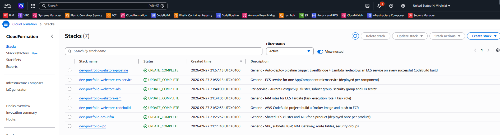
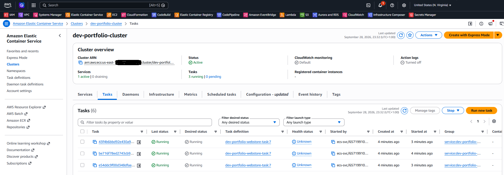

# Generic AWS CloudFormation — ECS Fargate Microservices

Reusable, parameter-driven **AWS CloudFormation** templates to host one or many containerized
microservices on **ECS Fargate**, with a shared network and load balancer, a per-service
CI/CD pipeline, and an optional per-service **Aurora PostgreSQL** database.

Nothing is product-specific: every name is derived from three parameters —
`Environment`, `ProductName` and `AppServiceName` — so the same templates can be reused for any
product, environment (`dev` / `staging` / `prod`) and service.

---

## What you get

| Concern | Provided by |
|---|---|
| Network (VPC, 2 public + 2 private subnets, IGW, NAT, security groups) | `aws-vpc-stack.yml` |
| Shared ECS cluster + internet-facing Application Load Balancer | `aws-ecs-infra-stack.yml` |
| Docker build from GitHub → ECR (immutable tags, scan on push) | `per-service/aws-codebuild-stack.yml` |
| ECS task execution role + task role | `per-service/aws-iam-stack.yml` |
| Aurora PostgreSQL Serverless v2, managed secret, subnet group, SG | `per-service/aws-rds-aurora-stack.yml` |
| Task definition, ECS service, target group, ALB path rule | `per-service/aws-ecs-service-stack.yml` |
| Auto-redeploy on every successful build (EventBridge + Lambda) | `per-service/aws-pipeline-stack.yml` |

---

## Architecture

Infrastructure has two tiers. The **product tier** is deployed once per environment; the
**service tier** is deployed once per microservice and shares everything in the product tier.

```
PRODUCT TIER (once per product × environment)
  vpc        → VPC, subnets, IGW, NAT Gateway, sg-alb, sg-ecs
  ecs-infra  → ECS cluster + ALB + HTTP :80 listener (default action: 404)

SERVICE TIER (once per microservice × environment)
  codebuild    → ECR repository + CodeBuild project (GitHub → Docker → ECR)
  iam          → ECS task execution role + task role
  rds          → Aurora PostgreSQL cluster + secret (optional, if the service needs a DB)
  ecs-service  → task definition + ECS service + target group + ALB rule  /<AppServiceName>/*
  pipeline     → EventBridge rule + Lambda that redeploys the service after a build
```

```
Internet
   │
   ▼
ALB (public subnets, HTTP :80)
   ├── /catalog/*  → Target group → ECS service "catalog"  ─┐
   ├── /orders/*   → Target group → ECS service "orders"   ─┼─► Fargate tasks (private subnets)
   └── anything else → 404                                  ─┘        │ outbound via NAT
                                                                      ▼
                                                        Aurora PostgreSQL (per service)
```

```
Delivery flow (per service)

GitHub ──► CodeBuild ──► ECR
              │ build SUCCEEDED
              ▼
        EventBridge ──► Lambda ──► new task definition revision ──► ECS service (rolling redeploy)
                          ▲
                          └── image tag read from SSM Parameter Store
```

### Design decisions

- **Shared cluster and ALB, path-based routing.** Each service is reachable at `/<AppServiceName>/*`
  and needs a unique `ListenerRulePriority`. The app must run with
  `server.servlet.context-path=/<AppServiceName>`.
- **Image tag lives in SSM, not in the template.** The task definition resolves
  `<ecr-uri>:{{resolve:ssm:/<env>-<product>-<service>-imageTag}}`. There is no `ImageTag`
  parameter on the service stack.
- **`DesiredCount` defaults to `0`.** CloudFormation creates the service without starting tasks;
  you start and scale them explicitly (see [`RUN-STACK-INSTRUCTIONS.md`](RUN-STACK-INSTRUCTIONS.md)).
- **Task definitions are retained** (`DeletionPolicy: Retain`) so old revisions stay available for rollback.
- **Tasks run in private subnets** with `awsvpc` networking and target type `ip`; only the ALB is public.
- **No plaintext secrets.** The database password is generated and stored in Secrets Manager;
  the task receives `DB_HOST`, `DB_PORT`, `DB_NAME` and the secret reference.
- **Stacks are wired with `Fn::ImportValue` / `Outputs.Export`**, never copied ARNs.
- **Aurora keeps a final snapshot** on delete (`DeletionPolicy: Snapshot`).

---

## Repository layout

```
cloud-formation/
├── aws-vpc-stack.yml               # product tier: network
├── aws-ecs-infra-stack.yml         # product tier: ECS cluster + ALB
├── RUN-STACK-INSTRUCTIONS.md       # full deploy / operate command reference (PowerShell)
└── per-service/
    ├── aws-codebuild-stack.yml     # ECR + CodeBuild
    ├── aws-iam-stack.yml           # ECS roles
    ├── aws-rds-aurora-stack.yml    # Aurora PostgreSQL Serverless v2
    ├── aws-ecs-service-stack.yml   # task definition, service, target group, ALB rule
    └── aws-pipeline-stack.yml      # auto-redeploy on build success
```

---

## Naming conventions

| Item | Pattern | Example (`dev`, `shop`, `catalog`) |
|---|---|---|
| Stack (product tier) | `<env>-<product>-<tier>` | `dev-shop-vpc`, `dev-shop-ecs-infra` |
| Stack (service tier) | `<env>-<product>-<service>-<tier>` | `dev-shop-catalog-ecs-service` |
| ECS cluster | `<env>-<product>-cluster` | `dev-shop-cluster` |
| ECS service | `<env>-<product>-<service>-service` | `dev-shop-catalog-service` |
| ECR repository | `<env>-<product>-<service>-repo` | `dev-shop-catalog-repo` |
| SSM image tag | `/<env>-<product>-<service>-imageTag` | `/dev-shop-catalog-imageTag` |
| Export names | `<env>-<product>[-<service>]-<output>` | `dev-shop-vpc-id` |

---

## Prerequisites

- An AWS account and the [AWS CLI](https://docs.aws.amazon.com/cli/latest/userguide/getting-started-install.html), authenticated (`aws login` or any profile).
- A **GitHub CodeConnections** connection in `AVAILABLE` state (AWS Console → CodeBuild → Source credentials → GitHub → OAuth). Its ARN is passed as `GitHubConnectionArn`; the template has no default for it.
- A `Dockerfile` and a `buildspec.yml` in the application repository (the buildspec file name is the `BuildSpecFile` parameter).

Set the shared variables once per shell session (PowerShell shown; the same values apply to any shell).
Don't hardcode account IDs, ARNs or tokens in committed files.

```powershell
$Environment         = "dev"                      # dev | staging | prod
$ProductName         = "portfolio"
$AppServiceName      = "webstore"
$StackPrefix         = "$Environment-$ProductName"   # -> "dev-portfolio"
$AwsAccountId        = "<12-digit AWS account id>"
$GitHubConnectionArn = "<arn:aws:codeconnections:...>"   # create it first: RUN-STACK-INSTRUCTIONS.md, "2. GitHub connection (private repositories)"
$GitHubOwner         = "<github org or user>"
$GitHubRepo          = "<repository name>"
$GitHubBranch        = "main"
```

---

## Deploy

Run from the `cloud-formation/` folder. Every `aws cloudformation deploy` call uses
`--capabilities CAPABILITY_NAMED_IAM CAPABILITY_AUTO_EXPAND` and `--region <region>`.

### Order

| # | Tier | Step | Stack name |
|---|---|---|---|
| 1 | Product | `aws-vpc-stack.yml` | `$StackPrefix-vpc` |
| 2 | Product | `aws-ecs-infra-stack.yml` | `$StackPrefix-ecs-infra` |
| 3 | Service | `per-service/aws-codebuild-stack.yml` | `$StackPrefix-$AppServiceName-codebuild` |
| 4 | Service | `per-service/aws-iam-stack.yml` | `$StackPrefix-$AppServiceName-iam` |
| 5 | Service | `per-service/aws-rds-aurora-stack.yml` *(optional but required by the current service stack, which imports the DB outputs)* | `$StackPrefix-$AppServiceName-rds` |
| 6 | Service | `aws ssm put-parameter` for the image tag | — |
| 7 | Service | `per-service/aws-ecs-service-stack.yml` | `$StackPrefix-$AppServiceName-ecs-service` |
| 8 | Service | `per-service/aws-pipeline-stack.yml` | `$StackPrefix-$AppServiceName-pipeline` |

Example for one stack (all others follow the same shape; see
[`RUN-STACK-INSTRUCTIONS.md`](RUN-STACK-INSTRUCTIONS.md) for every command with its parameters):

```powershell
aws cloudformation deploy `
  --stack-name "$StackPrefix-vpc" `
  --template-file ./aws-vpc-stack.yml `
  --capabilities CAPABILITY_NAMED_IAM CAPABILITY_AUTO_EXPAND `
  --parameter-overrides Environment=$Environment ProductName=$ProductName
```

---
#### AWS WEB CONSOLE

This is the CloudFormation console after running the deploy steps above for one real example:
environment `dev`, product `portfolio`, service `webstore` (`$StackPrefix` = `dev-portfolio`).
The 8 steps produce **7 stacks**, because step 6 is an SSM parameter and not a stack. All of them
show a `*_COMPLETE` status.

| Tier | Stack | Step |
|---|---|---|
| Product | `dev-portfolio-vpc` | 1 |
| Product | `dev-portfolio-ecs-infra` | 2 |
| Service | `dev-portfolio-webstore-codebuild` | 3 |
| Service | `dev-portfolio-webstore-iam` | 4 |
| Service | `dev-portfolio-webstore-rds` | 5 |
| Service | `dev-portfolio-webstore-ecs-service` | 7 |
| Service | `dev-portfolio-webstore-pipeline` | 8 |

The two product-tier stacks are shared. A second microservice would add its own five service-tier stacks
next to these, named `dev-portfolio-<service>-…`.



### First deploy of a service

1. Deploy steps 1–5, then create the image-tag parameter before the service stack:
   ```powershell
   aws ssm put-parameter --name "/$StackPrefix-$AppServiceName-imageTag" `
     --value 1.0.0 --type String
   ```
2. Build and push the first image:
   ```powershell
   aws codebuild start-build --project-name "$StackPrefix-$AppServiceName-codebuild" `
     --environment-variables-override name=IMAGE_TAG,value=1.0.0,type=PLAINTEXT
   ```
3. Deploy the service stack (unique `ListenerRulePriority` per service), then the pipeline stack.
4. Start the tasks (`DesiredCount` is `0` by default):
   ```powershell
   aws ecs update-service --cluster "$StackPrefix-cluster" `
     --service "$StackPrefix-$AppServiceName-service" `
     --desired-count 3 --force-new-deployment
   ```

   The screenshot below is the result of this step in the `dev` / `portfolio` / `webstore` example: the
   ECS console for `dev-portfolio-cluster`, where the service tasks are **Running** as Fargate tasks
   (here 3 running, 0 pending) from task definition `dev-portfolio-webstore-task`.

   

After that, every successful CodeBuild build redeploys the service automatically.

### Adding another microservice

Deploy steps 3–8 again with a new `AppServiceName` and a new `ListenerRulePriority`.
The VPC, cluster and ALB are reused.

### Teardown (reverse order)

`ecs-service` → `pipeline` → `rds` (final snapshot is taken) → `iam` → `codebuild` → `ecs-infra` → `vpc`.
Delete all service-tier stacks of every service before the product-tier stacks, because
the product tier's exports are in use.

---

## Parameters you will most often set

| Parameter | Stack | Default | Notes |
|---|---|---|---|
| `Environment` | all | `dev` | `dev`, `staging` or `prod` |
| `ProductName` | all | — | Required |
| `AppServiceName` | service tier | — | Required |
| `AwsAccountId` | ecs-infra, codebuild, pipeline | — | Required |
| `GitHubOwner`, `GitHubRepo`, `GitHubConnectionArn` | codebuild | — | Required; `GitHubBranch` defaults to `main` |
| `ContainerPort` | vpc, ecs-service | `8080` | Keep both in sync |
| `HealthCheckPath` | ecs-service | `/actuator/health` | Pass only the suffix; the template prepends `/<AppServiceName>` |
| `ListenerRulePriority` | ecs-service | — | Unique per service on the shared ALB |
| `TaskCpu` / `TaskMemory` | ecs-service | `512` / `1024` | Must be a valid Fargate combination |
| `DesiredCount` | ecs-service | `0` | Scale after deploy |
| `DbName`, `ServerlessMinCapacity`, `ServerlessMaxCapacity` | rds | `appdb`, `0.5`, `2` | Aurora capacity units |
| `DeletionProtection`, `BackupRetentionDays` | rds | `false`, `7` | Enable protection in `prod` |

Each template's `Parameters` section is the source of truth for the full list.

---

## Known limitations

- The ALB listens on **HTTP :80 only**. Add an ACM certificate and an HTTPS listener before exposing production traffic.
- A **single NAT Gateway** serves both private subnets — cheap, but not zone-fault tolerant.
- **Fargate only.** There is no EC2 capacity (ASG / capacity provider) variant in this repository.
- The service stack currently **requires the RDS stack** (it imports its outputs). A service without a database needs those imports and environment variables removed.
